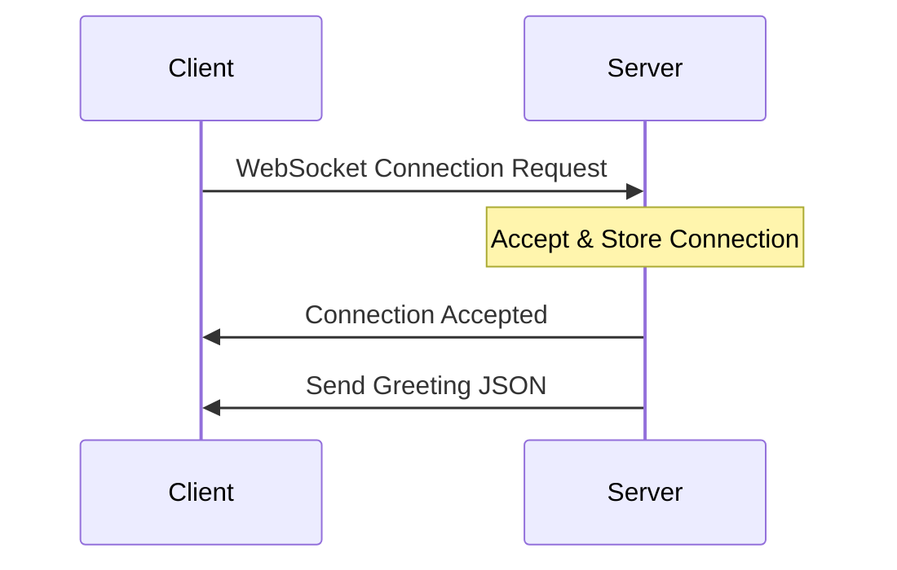
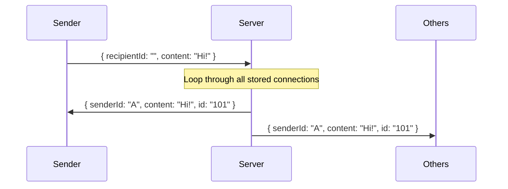
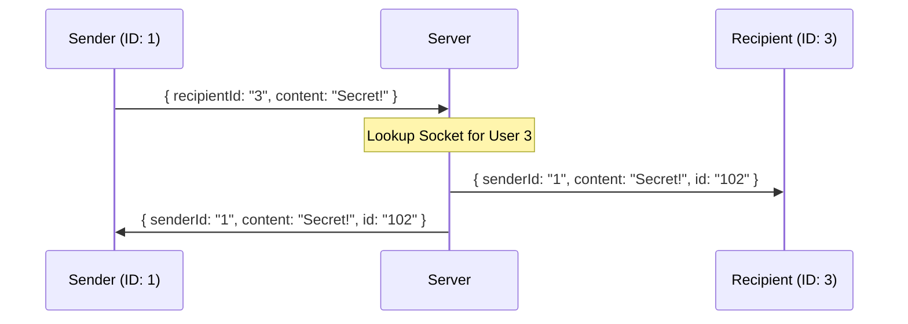

<p align="center">

</p>

# BeeChat

BeeMail 2.0 was a runaway success! Our user numbers are off the charts, and we’ve raised more venture capital.

Now, we’re adding a new feature, instant messaging...

We're calling it **BeeChat**, help us make it the buzz of the tech world.

## User Interface

Our front-end engineers have built the UI in the `client` folder. It is a real-time chat interface built with Vue.js. **You won't be updating the the UI today** but it’s essential to understand its functionality and the data it sends/expects from your server.

### Client Functionality

1. The message form collects a `recipientId` and `content` from the user.
2. When "Send" is clicked, an event is triggered that emits the message form data to the backend via WebSockets.
3. The chat feed automatically renders an array of "replies" sent from the backend.

> [!NOTE]
> The front-end expects a WebSocket server running on **port 5001**.
> Make sure to refresh your browser after your server starts to establish the connection.

### The Server-Client Data Contract

To "hook up" your backend, your server must process and emit JSON objects with these properties to work with the frontend:

- Outgoing (Sent by User): `{ "recipientId": "", "content": "" }`
- Incoming (Received by User): `{ "senderId": "", "content": "", "id": "" }`

> [!IMPORTANT]
> All IDs should be handled as **Strings**.

---

## Getting Started

Use the Tech Docs for your language or follow your coach's instructions to set up your server:

- [Javascript (Express/WS)](https://tech-docs.corndel.com/express/web-socket-server.html)
- [Java (Javalin)](https://tech-docs.corndel.com/javalin/web-socket-server.html)

**Running the Front-End**

- VS Code: Use the Live Server extension on `index.html`.
- IntelliJ: Right-click `index.html` -> Open in -> Browser.

---

## WebSockets

We need you to build the WebSocket server in the `server` directory.

You will progress through three stages of connectivity and chat functionality.

### Stage 1: Establish a Connection

Let’s see if we can get the frontend to bee-have and connect to your server.

Your first goal is to complete the "handshake" and hook the client up to the server.

1. **Set up your server** and open a WebSocket port on **5001**.
2. **Verify connection:** Check the browser’s developer console to see the success message.
3. **Store the connection:** You must store the connection/session in a data structure (like a List or Map).
   - This is vital for sending messages later!
4. **The Greeting:** On a successful connection, the server must send a greeting JSON to the client whom connected:

```json
{ "senderId": "0", "content": "Hello from the server!", "id": "greet-0" }
```

5. Once sent, the message should be visible in the client's UI.

**Sequence Diagram: Connection**



### Stage 2: Global Messaging

We’re ready to get the whole hive talking.

If a user sends a message without specifying an ID, it needs to be **broadcast** to everyone!

1. **Detection:** When a message is received, if the `recipientId` is a blank string (`""`), the server should broadcast the message.
2. **Delivery:** The broadcast must go to **every** connected client, including the sender.
   - This is why storing the connection/session in Stage 1 was important!
3. **Identity:** Ensure you attach a unique `id` to the message so the UI can display it.
   - This doesn't have to be fancy, a simple incrementing counter is fine.

**Sequence Diagram: Broadcast**



### Stage 3: Targeted Messaging

Make sure those messages are flying straight to the right bee.

Allow users to send Direct Messages to specific IDs.

1. **Assign IDs:** When a new WebSocket connects, assign that user a unique ID (or use the connection's internal ID if provided).
2. **Route Messages:** If `recipientId` is "3", lookup the specific socket for User 3 and send the message only to them (and the sender).

**Sequence Diagram: Targeted Messaging**



---

## Stretch Goals

### 1. The "Who's Online?" List

Every time a new user connects or disconnects, broadcast a "system" message to everyone containing a list of all currently active User IDs.

- _Challenge:_ How do you update the list when someone closes their browser tab?

### 2. Message Persistence (The "History" Feature)

Store the last 10 messages in a simple Array or List on the server. When a new user connects, send them these history objects immediately after the greeting so they can see the previous conversation.

### 3. Implement the Mediator Design Pattern

Refactor your code to ensure the **Routing Logic** is separated from the **Connection Logic**.

- Create a `ChatMediator` class, this class should hold the List or Map of all users and handle a method like `handleMessage(senderId, recipientId, content)`.
- When a WebSocket receives a message, it should simply pass the data to the central `ChatMediator` to decide where it goes.

---
